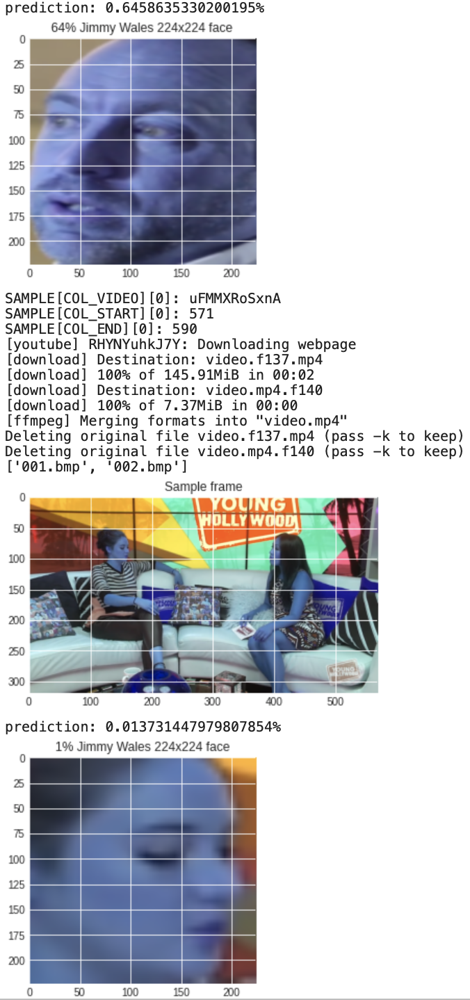

# What's this?

In [this](experiment.ipynb) interactive python notebook I am trying to fine-tune a VGG-16 (Machine Learning) model to adjust it to verify the identity of a given person face from a YouTube videos.

The face labels and YouTube links dataset comes from another personal experiment, [VideoQuotes](https://github.com/yoga1290/videoquotes#readme)

Note, this is a WIP; I am just playingaround for now!

# Run

### [Open in Google CoLab](https://colab.research.google.com/github/yoga1290/experiment-ffmpeg-vgg/blob/main/experiment.ipynb)

### Run on docker-compose

+ Clone this repository
+ Run the commandline: `docker-compose up`
+ Open the provided link in the terminal
+ Have fun!

